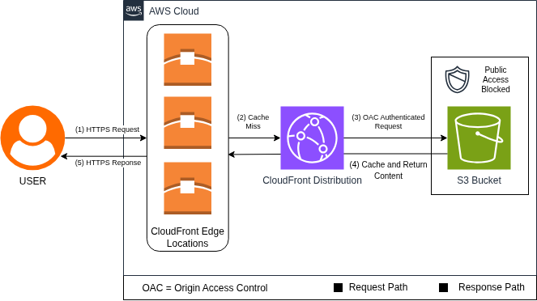

# S3 + CloudFront Static Website - Terraform Reference

Terraform configuration for deploying a static site to S3 behind CloudFront CDN. Uses Origin Access Control (OAC) to keep the bucket private while allowing CloudFront access.

## Architecture



### Components
- **S3 Bucket** - Private bucket storing static website files
- **CloudFront Distribution** - Global CDN for fast content delivery
- **Origin Access Control (OAC)** - AWS-recommended method for CloudFront-to-S3 authentication

### How it Works

CloudFront serves cached content from edge locations (1hr TTL). On cache miss, it authenticates to the private S3 bucket using OAC. The bucket has all public access blocked.

## Prerequisites

- Terraform >= v1.14
- AWS CLI v2 configured with appropriate credentials
- S3 backend for Terraform state (bucket + DynamoDB table with LockID key)

## Usage

### Configuration

1. **Clone the repository** to your local system

2. **Configure backend** (if using remote state):
   - Update `backend.tf` with your S3 bucket name and DynamoDB table name

3. **Review variables** in `variables.tf`:
   - `project_name` - Name for your project (used with AWS Account ID for unique S3 bucket name)
   - `content_path` - Path to website files (defaults to `./website/`)
   - `index_document` - Default page (default: `index.html`)
   - `error_document` - Error page (default: `error.html`)
   - `environment` - Environment tag (default: `dev`)

4. **Set required variables** in `terraform.tfvars`:
```hcl
   project_name = "your-project-name"
```
   You can override any other variables here as needed.

### Deployment
```bash
# Initialize Terraform (downloads providers, configures backend)
terraform init

# Preview changes
terraform plan

# Deploy infrastructure
terraform apply

# Clean up (note: S3 bucket must be empty first)
terraform destroy
```

**Note:** CloudFront distributions take 5-10 minutes to deploy.

### Accessing Your Site

After successful deployment, Terraform outputs the CloudFront domain:
```
domain = "<generated-subomain>.cloudfront.net"
```

Navigate to this URL in your browser to view your site.

### Key Features
- Current recommended security with Origin Access Control instead of Origin Access Identity for CloudFront-to-S3 authentication
- Private S3 bucket for security, less of a attack surface for nefarious actors
- CloudFront CDN caching, faster site response time provided by edge locations
- Easy deployment, update, and destroy through Terraform deployment

### Future Enhancements
- Currently only allows GET/HEAD, make configurable for other verbs
- Add cache invalidation trigger for deployments
- Custom domain support (Route53 + ACM)

## Author

Jason Snyder - [GitHub](https://github.com/snyderjk) | [LinkedIn](https://linkedin.com/in/jason-devops)

Part of an AWS Infrastructure as Code Reference Project Repository
