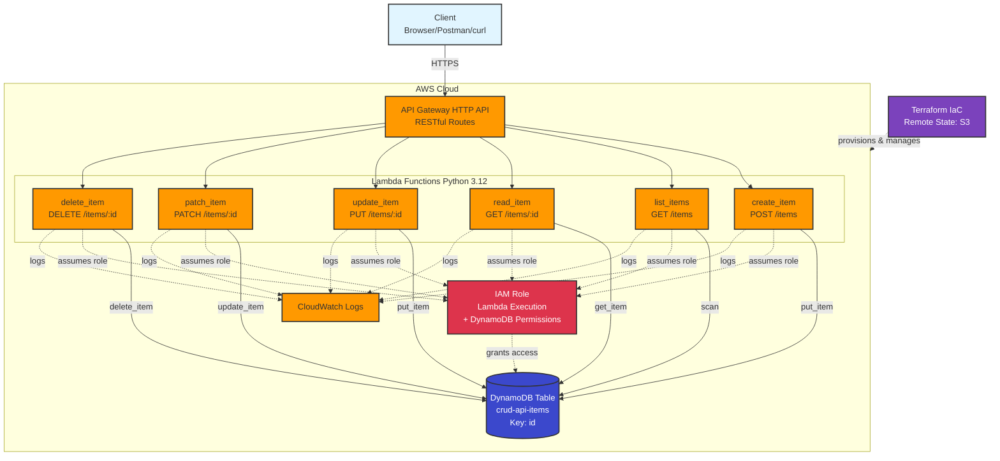

# Serverless CRUD API

A production-ready serverless REST API built with AWS Lambda, API Gateway, and DynamoDB, fully deployed using Terraform Infrastructure as Code. Reference project for use in other projects

## Overview

This project demonstrates modern serverless architecture patterns by implementing a complete CRUD (Create, Read, Update, Delete) API following REST best practices. It showcases proper separation of concerns, least-privilege IAM policies, and professional infrastructure management.

### Key Features

- **6 Lambda Functions** - Separate functions for each operation following single responsibility principle
- **Complete REST Semantics** - Implements both PUT (full replacement) and PATCH (partial update) for proper REST compliance
- **RESTful API Design** - Proper HTTP methods (GET, POST, PUT, PATCH, DELETE) with appropriate status codes
- **IAM Least Privilege** - DynamoDB permissions scoped to specific table and operations
- **CORS Enabled** - Ready for browser-based clients and frontend integration
- **Infrastructure as Code** - Fully automated deployment with Terraform
- **Remote State Management** - S3 backend with DynamoDB state locking for team collaboration
- **Environment Configuration** - Lambda functions use environment variables for flexibility

## Architecture



```
```
### AWS Services Used

- **API Gateway (HTTP API)** - RESTful endpoint routing with automatic stage deployment
- **AWS Lambda (Python 3.12)** - Serverless compute for business logic
- **DynamoDB** - NoSQL database with pay-per-request billing
- **IAM** - Secure service-to-service authentication and authorization
- **CloudWatch Logs** - Centralized logging for debugging and monitoring
- **S3** - Remote Terraform state storage
- **DynamoDB** - Terraform state locking

### Data Model

Items stored in DynamoDB with the following schema:
- `id` (String, Partition Key) - UUID v4
- `name` (String, Required) - Item name
- `description` (String, Optional) - Item description
- `status` (String, Optional) - active/inactive
- `metadata` (Object, Optional) - Flexible key-value pairs
- `created_at` (String) - ISO 8601 timestamp
- `updated_at` (String) - ISO 8601 timestamp

### API Endpoints

| Method | Endpoint | Lambda Function | Description |
|--------|----------|----------------|-------------|
| POST | `/items` | create_item | Create a new item |
| GET | `/items` | list_items | List all items |
| GET | `/items/{id}` | read_item | Get a specific item |
| PUT | `/items/{id}` | update_item | Replace entire item (requires all fields) |
| PATCH | `/items/{id}` | patch_item | Partial update (only provided fields) |
| DELETE | `/items/{id}` | delete_item | Delete an item |

## Technology Stack

**Infrastructure:**
- Terraform v1.14
- AWS Provider v2

**Runtime:**
- Python 3.12
- boto3 (AWS SDK)

**AWS Services:**
- Lambda
- API Gateway v2 (HTTP API)
- DynamoDB
- IAM
- CloudWatch Logs

## Project Structure

```
serverless-crud-api/
├── terraform/
│   ├── provider.tf           # AWS provider configuration
│   ├── backend.tf            # S3 + DynamoDB remote state
│   ├── variables.tf          # Input variables
│   ├── main.tf               # Common tags and locals
│   ├── dynamodb.tf           # DynamoDB table definition
│   ├── iam.tf                # Lambda execution role and policies
│   ├── lambda.tf             # Lambda function definitions
│   ├── api_gateway.tf        # API Gateway routes and integrations
│   └── outputs.tf            # Output values (API URL, etc.)
├── lambda/
│   ├── create_item/
│   │   └── index.py          # POST handler
│   ├── read_item/
│   │   └── index.py          # GET single item handler
│   ├── update_item/
│   │   └── index.py          # PUT handler (full replacement)
│   ├── patch_item/
│   │   └── index.py          # PATCH handler (partial update)
│   ├── delete_item/
│   │   └── index.py          # DELETE handler
│   └── list_items/
│       └── index.py          # GET all items handler
├── schemas/
│   └── item_schema.json      # JSON schema for data validation
├── .gitignore
└── README.md
```

## Deployment

### Prerequisites

- AWS CLI configured with credentials
- Terraform >= 1.0
- AWS account with appropriate permissions
- Existing S3 bucket for Terraform state: 
- Existing DynamoDB table for state locking: 

### Deploy the Infrastructure

1. **Clone the repository**
   ```bash
   git clone <your-repo-url>
   cd serverless-crud-api
   ```

2. **Configure variables**
   Create `terraform/terraform.tfvars`:
   ```hcl
   project_name = "serverless-crud-api"
   environment  = "dev"
   ```

3. **Initialize Terraform**
   ```bash
   cd terraform
   terraform init
   ```

4. **Review the plan**
   ```bash
   terraform plan
   ```

5. **Deploy**
   ```bash
   terraform apply
   ```

6. **Get your API URL**
   ```bash
   terraform output api_gateway_url
   ```

### Tear Down

```bash
terraform destroy
```

## Usage Examples

Replace `{API_URL}` with your API Gateway endpoint from terraform output.

### Create an Item

```bash
curl -X POST {API_URL}/items \
  -H "Content-Type: application/json" \
  -d '{
    "name": "My First Item",
    "description": "Testing the API",
    "status": "active",
    "metadata": {"priority": "high"}
  }'
```

**Response (201):**
```json
{
  "message": "Item created successfully",
  "data": {
    "id": "550e8400-e29b-41d4-a716-446655440000",
    "name": "My First Item",
    "description": "Testing the API",
    "status": "active",
    "metadata": {"priority": "high"},
    "created_at": "2024-12-05T10:30:00Z",
    "updated_at": "2024-12-05T10:30:00Z"
  }
}
```

### List All Items

```bash
curl {API_URL}/items
```

**Response (200):**
```json
{
  "data": [...],
  "count": 5
}
```

### Get Specific Item

```bash
curl {API_URL}/items/{item-id}
```

**Response (200):**
```json
{
  "data": {
    "id": "550e8400-e29b-41d4-a716-446655440000",
    "name": "My First Item",
    ...
  }
}
```

### Update Item (PUT - Full Replacement)

```bash
curl -X PUT {API_URL}/items/{item-id} \
  -H "Content-Type: application/json" \
  -d '{
    "name": "Updated Item",
    "description": "Completely replaced all fields",
    "status": "inactive"
  }'
```

**Note:** PUT requires the `name` field and replaces the entire item.

### Patch Item (PATCH - Partial Update)

```bash
curl -X PATCH {API_URL}/items/{item-id} \
  -H "Content-Type: application/json" \
  -d '{
    "description": "Only updating this field"
  }'
```

**Note:** PATCH only updates the fields you provide.

### Delete Item

```bash
curl -X DELETE {API_URL}/items/{item-id}
```

**Response (204):** No content

### Verify Deletion

```bash
curl {API_URL}/items/{item-id}
```

**Response (404):**
```json
{
  "error": "Item not found"
}
```

## Design Decisions

### Why Separate PUT and PATCH?

Many serverless examples conflate these operations, but they have distinct REST semantics:

- **PUT** - Idempotent full replacement. Client sends complete resource representation. Uses `put_item()` in DynamoDB.
- **PATCH** - Partial modification. Client sends only fields to change. Uses `update_item()` with UpdateExpression.

Implementing both demonstrates understanding of REST principles and provides flexibility for API consumers. In interviews, this shows deeper knowledge than typical CRUD implementations.

### Why HTTP API (v2) vs REST API (v1)?

API Gateway v2 (HTTP API) was chosen because:

- **Simpler** - Less configuration overhead, automatic stage deployment
- **Cheaper** - ~71% cost reduction compared to REST API
- **Faster** - Lower latency for Lambda integrations
- **Modern** - Built-in CORS, JWT authorizers, better defaults

REST API (v1) offers more features (API keys, usage plans, request/response transformations), but HTTP API meets the needs of most serverless applications.

### Why Separate Lambda Functions?

Rather than a single monolithic Lambda:

- **Single Responsibility Principle** - Each function does one thing well
- **Independent Scaling** - AWS scales each function independently based on traffic
- **Easier Testing** - Smaller, focused functions are easier to test and debug
- **Granular Permissions** - Could implement least-privilege per function (currently shared for simplicity)
- **Clearer Logs** - Separate CloudWatch log groups per function
- **Portfolio Value** - Shows architectural thinking beyond "make it work"

Trade-off: More functions = more cold starts, but for a reference project this is acceptable. In production, you'd analyze traffic patterns to decide on function granularity.

### Why On-Demand vs Provisioned DynamoDB?

- **On-Demand Billing** - Only pay for actual requests, no idle costs
- **Simpler** - No capacity planning required
- **Dev/Test Friendly** - Perfect for portfolios and low-traffic APIs

For production with predictable traffic, provisioned capacity might be cheaper.

### IAM Design: Shared vs Per-Function Roles

Currently using a **shared IAM role** across all Lambda functions with full CRUD permissions on the DynamoDB table.

**Why shared:**
- All functions access the same table
- Simpler Terraform (fewer resources)
- Security boundary is already clear (scoped to one table)
- Easier to understand for code review

**Production alternative:**
- Separate roles per function (read_item only gets GetItem permission)
- More secure but significantly more complex
- Better for multi-team environments

## What I Learned

### Technical Skills

- **DynamoDB UpdateExpression** - Building dynamic update expressions with ExpressionAttributeNames/Values is tricky but powerful
- **API Gateway Integration** - Understanding the difference between AWS_PROXY integration and request/response transformations
- **Lambda Permissions** - The Lambda function must explicitly grant API Gateway invoke permissions, not just IAM roles
- **Terraform Data Sources** - Using `archive_file` to package Lambda code automatically
- **REST Semantics** - The practical difference between PUT and PATCH in real implementations

### DevOps Practices

- **Remote State Management** - Critical for team collaboration and preventing state conflicts
- **Resource Organization** - Separating Terraform files by AWS service improves maintainability
- **Environment Variables** - Parameterizing Lambda functions makes them reusable across environments
- **Output Values** - Well-designed outputs make deployed infrastructure discoverable

### Python for AWS

- **boto3 Resource vs Client** - Resource API is higher-level and easier for most use cases
- **Lambda Event Structure** - API Gateway wraps requests in specific event format
- **Error Handling** - Proper HTTP status codes and error messages improve API usability
- **DynamoDB Types** - Understanding that DynamoDB is schema-less except for keys

## Future Enhancements

### Short Term
- **Pagination** - Implement DynamoDB pagination for large result sets in LIST operation
- **Input Validation** - Add JSON Schema validation in Lambda functions
- **Request/Response Logging** - Enhanced CloudWatch logging with request IDs
- **API Documentation** - OpenAPI/Swagger specification

### Medium Term
- **Authentication** - JWT authorizer with Cognito or Auth0
- **Rate Limiting** - API Gateway usage plans and throttling
- **Metrics** - CloudWatch custom metrics for business logic
- **Alarms** - CloudWatch alarms for error rates and latency

### Long Term
- **CI/CD Pipeline** - GitHub Actions or AWS CodePipeline for automated deployments
- **Multiple Environments** - Terraform workspaces for dev/staging/prod
- **Integration Tests** - Automated API testing with pytest
- **DynamoDB Streams** - Trigger additional workflows on data changes
- **Cost Optimization** - Reserved capacity for DynamoDB if usage patterns justify it

## Cost Considerations

This architecture is designed to be cost-effective:

- **API Gateway HTTP API** - $1.00 per million requests
- **DynamoDB** - On-demand: $1.25 per million writes, $0.25 per million reads
- **CloudWatch Logs** - $0.50 per GB ingested

For this reference project with light usage, monthly costs will be very low

## Security Best Practices Implemented

- ✅ IAM least-privilege policies (scoped to specific table)
- ✅ No hardcoded credentials (uses IAM roles)
- ✅ HTTPS only (enforced by API Gateway)
- ✅ Environment variables for configuration
- ✅ Remote state encryption enabled
- ✅ Private S3 bucket for state files
- ✅ CloudWatch Logs for audit trail

## Resources & References

- [AWS Lambda Developer Guide](https://docs.aws.amazon.com/lambda/)
- [DynamoDB Developer Guide](https://docs.aws.amazon.com/dynamodb/)
- [API Gateway HTTP API](https://docs.aws.amazon.com/apigateway/latest/developerguide/http-api.html)
- [Terraform AWS Provider](https://registry.terraform.io/providers/hashicorp/aws/latest/docs)
- [REST API Design Best Practices](https://restfulapi.net/)

## Author

Jason Snyder - [GitHub](https://github.com/snyderjk) | [LinkedIn](https://linkedin.com/in/jason-devops)

Part of an AWS Infrastructure as Code Reference Project Repository
